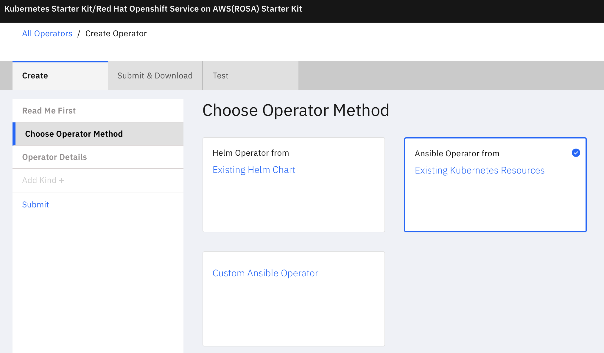
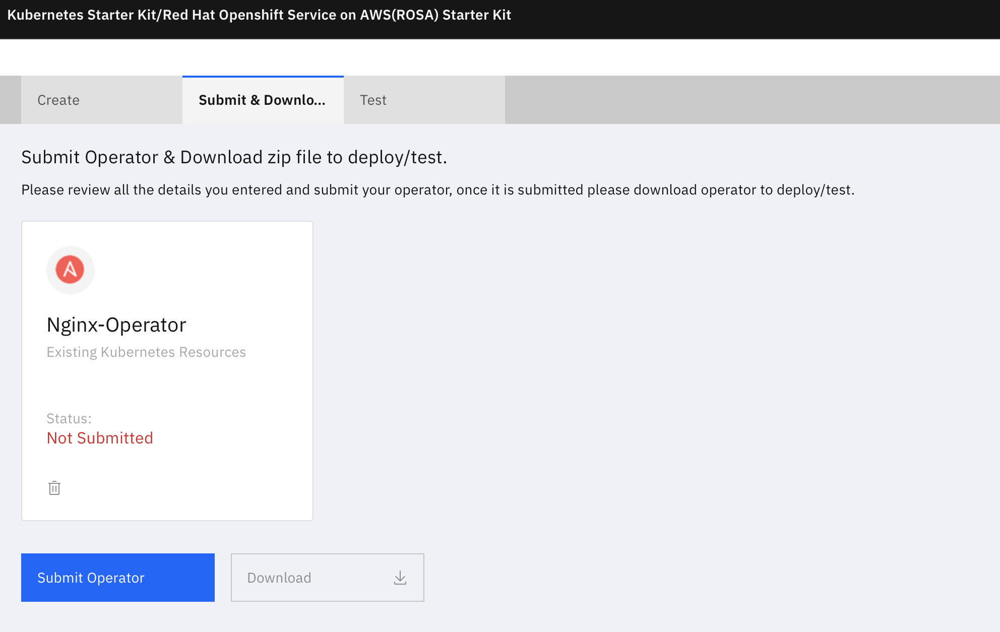

### 

This tutorial explains creating an Ansible Operator from the Kubernetes setup provided out of the box with this Lab.

Open the application: URL-   http://##DNS.IP##:3000

### 1 - Start creating the Operator

### 2 - Select the Method of creating Operator

Choose the Operator Method as **Ansible Operator from Existing Kubernetes Resources**

### 3 - Give the operator details and fetch the resources

Give the name of the Operator and details as below.

Since we are fetching from the Kubernetes provided out of the box, select **Use local Kubernetes** option and click button **Use local Kubernetes**.

Give the namespace from where resources are to be fetched. For this lab give the namespace as **local-k8s-setup**. Click button **Fetch resources** .

 

The **Add Kind +** option on the left panel will be enabled only if the resources are fetched successfully.

### 4 - Create a Kind using the K8s resources

Add a new CRD(Kind) using **Add Kind +**

Give the kind name. Select the resources that will make up the CRD.

### 

More than 1 Kind can be added.

### 5 - Create the Operator

Goto the Submit & Download tab.

Click **Submit Operator** to create the Operator.

If the Operator is created successfully, you will see a message as below.

