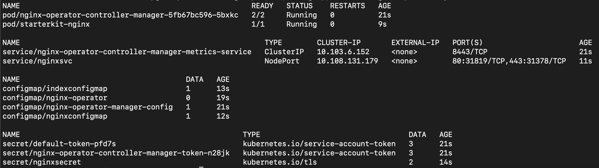

### 1 - APIs for using resources from local k8s and testing on local k8s
Switch to using the local Kubernetes

```execute
export IPaddr=$(hostname -I | cut -d' ' -f2)
curl --request POST \
  --url http://${IPaddr}:5001/copyconfig
```


### 2 - Fetch the k8s resources.

Fetch from the **local-k8s-setup** namespace from which the list of resources are used to create the Operator.

```execute
curl --request GET \
  --url http://${IPaddr}:5001/getresources?namespace=local-k8s-setup
```

Sample resource list

```
{
  "resources": {
    "configmaps": [
      "configmaps/indexconfigmap",
      "configmaps/nginxconfigmap"
    ],
    "cronjobs": [],
    "deployments": [],
    "jobs": [],
    "networkpolicies": [],
    "persistentvolumeclaims": [],
    "pods": [
      "pods/starterkit-nginx"
    ],
    "routes": [],
    "secrets": [
      "secrets/default-token-77wzj",
      "secrets/nginxsecret"
    ],
    "services": [
      "services/nginxsvc"
    ],
    "statefulsets": []
  }
}
```


### 3 - Create the Operator

Fill in the Operator details- **operatorname, version, groupname, domainname**

Give same namespace  as above in **namespace**

Copy the resources from the above list in **resourcenames** . 

```execute
curl --request POST \
  --url http://${IPaddr}:5001/ansibleoperator/createfromresources \
  --header 'Content-Type: application/json' \
  --data '{
 "groupname":"openlabs",
 "domainname":"ibm.com",
 "operatorname":"nginx-operator",
 "version":"v1beta1",
 "namespace":"local-k8s-setup",
 "kinds": [
   {
    "name": "ApplicationTest",
    "resourcenames": ["configmaps/indexconfigmap","configmaps/nginxconfigmap","pods/starterkit-nginx","secrets/nginxsecret","services/nginxsvc"]
   }
 ]
}'
```


### 4 - Test deploying the operator on the same local k8s. 

```execute
curl --request POST \
  --url 'http://${IPaddr}:5001/deploy?host=kubernetes&operator=nginx-operator'
```


### 5 - Check the status of the Operator deployment.

It takes about 30 seconds for the Operator to be up.

```execute
curl --request GET \
  --url http://${IPaddr}:5001/status?operator=nginx-operator&host=kubernetes
```

The response can be *True* or *False* or *InstalledButNotReady*


### 6 - Verify the Operator is deployed from the Kubernetes console

Operator is deployed  in the **[operator name]-system** namespace. 

```execute
kubectl get deployment -n nginx-operator-system
```

Get the resources installed by the CRD. It should give the resources selected while creating the Operator. 

```execute
kubectl get pod,svc,configmap,secret -n nginx-operator-system
```

Sample output-



Get the URL of the application you just deployed using the Operator and check from the browser.

```execute
echo "http://${IPaddr}:$(kubectl get service nginxsvc -n nginx-operator-system -o custom-columns=:spec.ports[0].nodePort | tail -1)"
```


### 7- Undeploy the Operator deployment from K8s

```execute
curl --request DELETE \
  --url http://${IPaddr}:5001/cleanup?host=kubernetes&operator=nginx-operator
```

Verify that the Operator is undeployed.

Check if the namespace created as part of the test still exists.

```execute
kubectl get namespace nginx-operator-system
```


### 8 - Download the Operator code.


```execute
curl --request GET \
  --url http://${IPaddr}:5001/downloadoperator?operator=nginx-operator
```

The Operator has the ReadMe for the next steps to certify the Operator.