### 1 - Create the namespace

```execute
kubectl create ns pgo
```

### 2 - Create the secret

Create the secret with Database configuration
```execute
kubectl create secret generic postgres-config --from-literal=POSTGRES_DB=contacts --from-literal=POSTGRES_USER=pguser --from-literal=POSTGRES_PASSWORD=password -n pgo
```

### 3 - Create the Persistent Volumes
Create Persistent Volume and Persistent Volume Claims.

```execute
cat <<EOF>volume.yaml
---
     kind: PersistentVolume
     apiVersion: v1
     metadata:
        name: postgres-pv-volume
        labels:
          type: local
          app: postgres
     spec:
        storageClassName: manual
        capacity:
          storage: 500Mi
        accessModes:
         - ReadWriteMany
        hostPath:
          path: "/mnt/data"
---
     kind: PersistentVolumeClaim
     apiVersion: v1
     metadata:
        name: postgres-pv-claim
        namespace: pgo
        labels:
          app: postgres
     spec:
        storageClassName: manual
        accessModes:
          - ReadWriteMany
        resources:
          requests:
            storage: 100Mi
EOF
```

```execute
kubectl apply -f volume.yaml
```

### 4 - Create the Database

Create the deployment that creates the Database instance.
```execute
cat <<EOF>deployment.yaml
      apiVersion: apps/v1
      kind: Deployment
      metadata:
        labels:
          app: postgres
        name: postgres
        namespace: pgo
      spec:
        replicas: 1
        selector:
          matchLabels:
            app: postgres
        strategy: {}
        template:
          metadata:
            labels:
              app: postgres
          spec:
            containers:
            - image: postgres:10.19
              name: postgres
              resources: {}
              ports:
                  - containerPort: 5432
              envFrom:
                  - secretRef:
                      name: postgres-config
              volumeMounts:
                  - mountPath: /var/lib/postgresql/data
                    name: postgredb
            volumes:
              - name: postgredb
                persistentVolumeClaim:
                  claimName: postgres-pv-claim
EOF
```

```execute
kubectl apply -f deployment.yaml
```

### 5 - Create the Database conectivity

Create the service to communicate with the Database.
```execute
cat <<EOF>service.yaml
      apiVersion: v1
      kind: Service
      metadata:
        name: contacts
        namespace: pgo
        labels:
          app: postgres
      spec:
        type: NodePort
        ports:
         - port: 5432
        selector:
          app: postgres
EOF
```

```execute
kubectl apply -f service.yaml
```

### 6 - Verify the Database setup 

Get the Cluster IP:

```execute
export ip_addr=$(ifconfig eth1 | grep inet | awk '{print $2}' | cut -f2 -d:)
echo $ip_addr
```
Check the connection to the Database

```execute
port=$(kubectl get svc contacts -n pgo -o custom-columns=:spec.ports[0].nodePort | tail -1)
nc -z -v -w30 $ip_addr $port
```

### 7 - Setup the application

Get the application
```execute
cd /home/student/projects && git clone https://github.com/operator-playground-io/crunchy-postgres-sample.git
```

Initialise the Database
```execute
export PGPASSWORD=$(kubectl get secret postgres-config -n pgo -o=jsonpath='{.data.POSTGRES_PASSWORD}' | base64 --decode)
echo $PGPASSWORD
cd /home/student/projects/crunchy-postgres-sample
PGPASSWORD=password psql -U pguser -h $ip_addr -p $port contacts < initialize-db.sql 2>output.txt
```

Update the configuration of the application

```execute
rm -rf /home/student/projects/crunchy-postgres-sample/k8s/contacts-pgcluster.yaml 
rm -rf /home/student/projects/crunchy-postgres-sample/k8s/contacts-service.yaml
cd /home/student/projects/crunchy-postgres-sample/k8s && sed -i "s|contacts-db.pgo.svc.cluster.local|contacts|" contacts-backend.deployment.yaml && sed -i "s|contacts.pgo.svc.cluster.local|contacts|" contacts-backend.deployment.yaml
echo "" >> contacts-frontend.deployment.yaml
echo '        - name: REACT_APP_SERVER_URL' >> contacts-frontend.deployment.yaml 
echo "          value: \"http://${ip_addr}:30456/contacts\"" >> contacts-frontend.deployment.yaml

cd /home/student/projects/crunchy-postgres-sample/frontend && export backend_port=30456 && sed -i "s|ip|$ip_addr|" .env && sed -i "s|port|$backend_port|" .env
skaffold config set default-repo localhost:5000
```

### 8 - Deploy the application

Start the application. This step will take ~5 mins.
```execute
cd /home/student/projects/crunchy-postgres-sample
skaffold run -n pgo
```

### 9 - Verify the setup is complete

Execute the below command. The result should have deployments for Database, backend and frontend running.
```execute
kubectl get deployments -n pgo
```


Copy the URL below and open in a browser to try the application.

```copy
http://{{ DNS.ip }}:30465
```


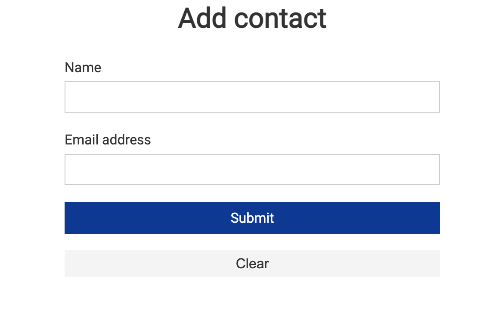

We have completed the setup of the application for which we want to create an Operator. The remaining steps explain how to use the StarterKit to create an Operator from this setup.

### 10 - Start creating the Operator using StarterKit

This tutorial explains creating an Ansible Operator from the Kubernetes setup provided out of the box with this Lab.
Open the StarterKit UI.
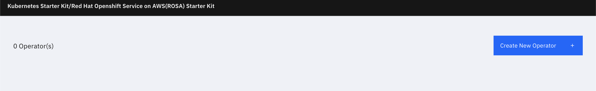

### 11 - Select the Method of creating Operator

Choose the Operator Method as **Ansible Operator from Existing Kubernetes Resources**


### 12 - Give the operator details and fetch the resources

Give the name of the Operator and details as below.

Since we are fetching from the Kubernetes provided out of the box, select **Use local Kubernetes** option and click button **Use local Kubernetes**.

Give the namespace from where resources are to be fetched. For this lab give the namespace as **pgo**. Click button **Fetch resources** .

The **Add Kind +** option on the left panel will be enabled only if the resources are fetched successfully.

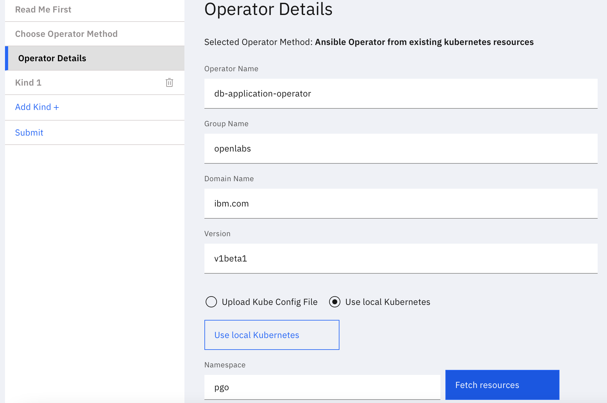

### 13 - Create a Kind using the K8s resources

Add a new CRD(Kind) using **Add Kind +**

Give the kind name as **SetupApp**. Select the resources that will make up the CRD. i.e. all the resources that we setup as part of the Database application. (Steps 1 to 9 above)


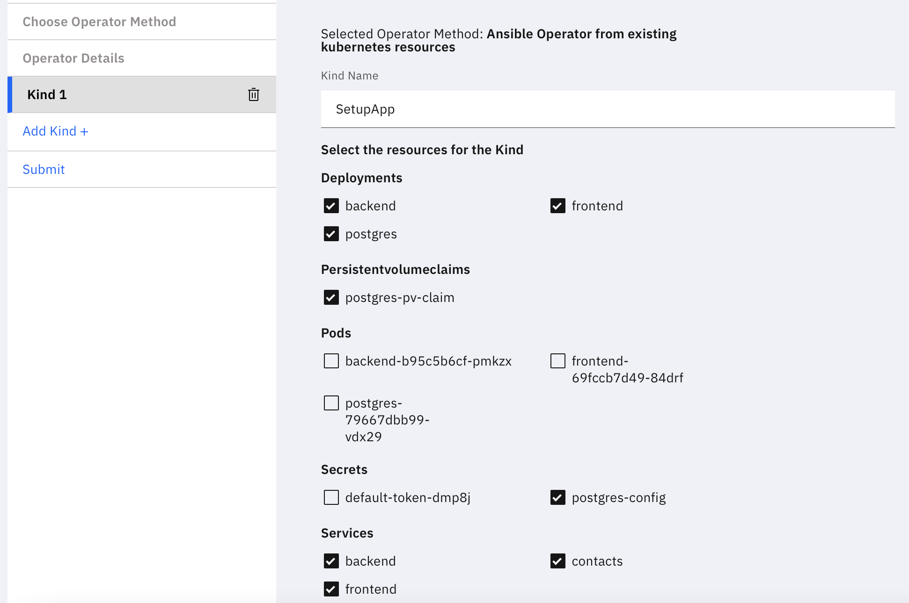


### 14 - Create the Operator

Goto the Submit & Download tab. Click **Submit Operator** to create the Operator.

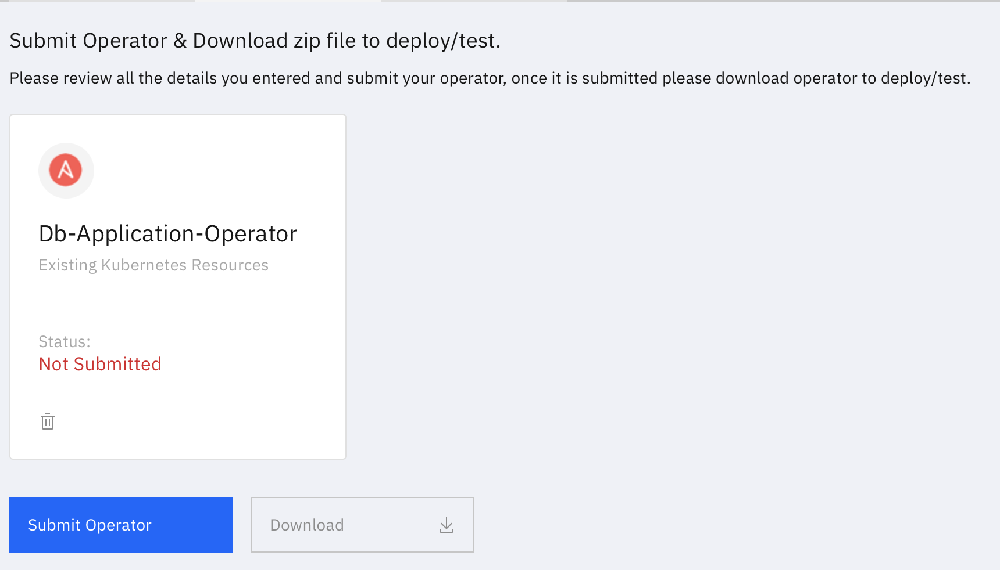


If the Operator is created successfully, you will see a message as below.

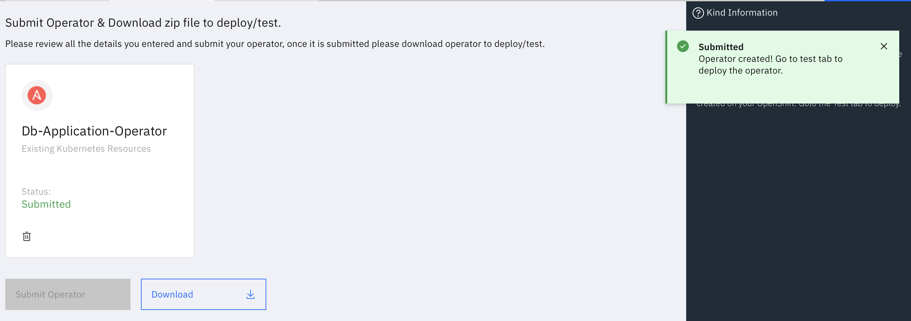

### 15 - Prepare for deploying the Operator

Create the Persistent Volume for the Database instance.
```execute
cat <<EOF>pvc-db.yaml
     kind: PersistentVolume
     apiVersion: v1
     metadata:
        name: postgres-pv-volume-new
        labels:
          type: local
          app: postgres
     spec:
        storageClassName: manual
        capacity:
          storage: 500Mi
        accessModes:
         - ReadWriteMany
        hostPath:
          path: "/mnt/datanew"
EOF
```
```execute
kubectl apply -f pvc-db.yaml
```

Update the operator code to replace older port values
```execute
export operatorname="db-application-operator"
export operatornamespace="$operatorname-system"

echo {{ SSH.pass }} | sudo -S sed -i 's|30456|30457|' /home/student/starterkit/operators/${operatorname}/roles/setupapp/tasks/main.yml
echo {{ SSH.pass }} | sudo -S sed -i '/port: 4000/a \ \ \ \ \ \ \ \ \ \ nodePort: 30457' /home/student/starterkit/operators/${operatorname}/roles/setupapp/tasks/main.yml
```


### 16 - Deploy the Operator

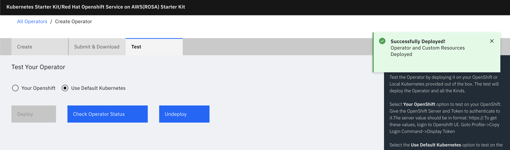


### 17 - Check Operator status

Wait for a ~60 seconds for the deployment to complete.

Click **Check Operator Status** to get the status of the Operator.

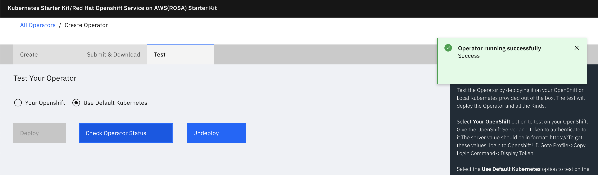


### 18 - Verify the Operator is deployed from the Kubernetes console

Operator is deployed  in the **[operator name]-system** namespace. 


```execute
kubectl get deployment db-application-operator-controller-manager -n $operatornamespace
```

Sample output-

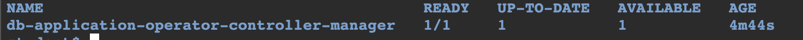

Get the resources installed by the CRD. It should give the resources selected while creating the Operator. 

```execute
kubectl get deployment,service,pvc,secret -n $operatornamespace
```

Sample output-

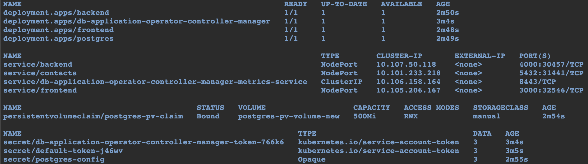

### 19 - Initilise the newly created DB

```execute
port=$(kubectl get svc contacts -n $operatornamespace -o custom-columns=:spec.ports[0].nodePort | tail -1)
cd /home/student/projects/crunchy-postgres-sample
PGPASSWORD=password psql -U pguser -h $ip_addr -p $port contacts < initialize-db.sql 2>output.txt
```


### 20 - Check the application deloyed by the Operator

Get the URL of the application you just deployed using the Operator and check from the browser.

```execute
echo "http://$(hostname -I | cut -d' ' -f2):$(kubectl get service frontend -n $operatornamespace -o custom-columns=:spec.ports[0].nodePort | tail -1)"
```


### 21 - Undeploy the Operator

Click **Undeploy** to un-install the Operator and the CRD.

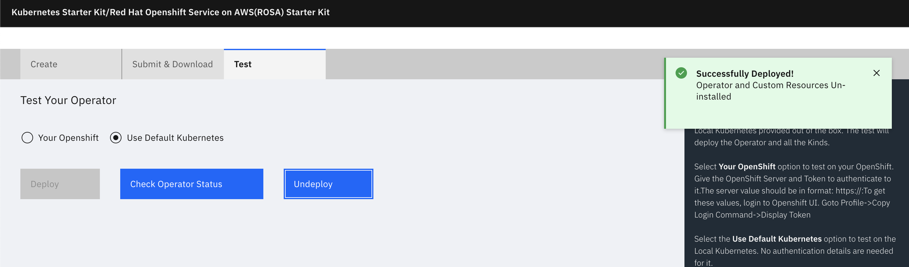


### 22 - Verify the Operator is Undeployed from the Kubernetes console

Check if the namespace created as part of the test still exists.

```execute
kubectl get namespace $operatornamespace
```


### 23 - Download the Operator Code

Goto the **Submit and Download** tab. Click the **Download** button.

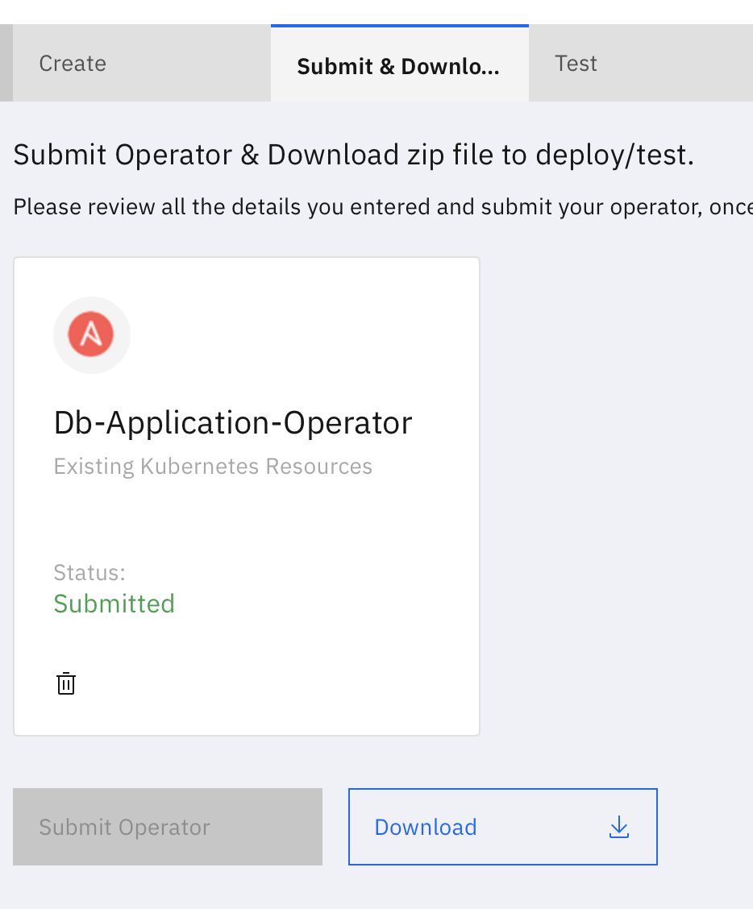

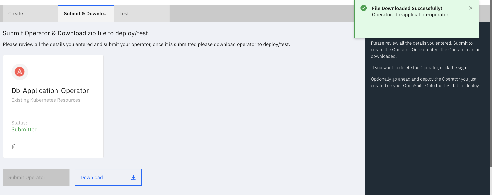


Alternate method.

Goto the main page. Click the download icon of the Operator.


