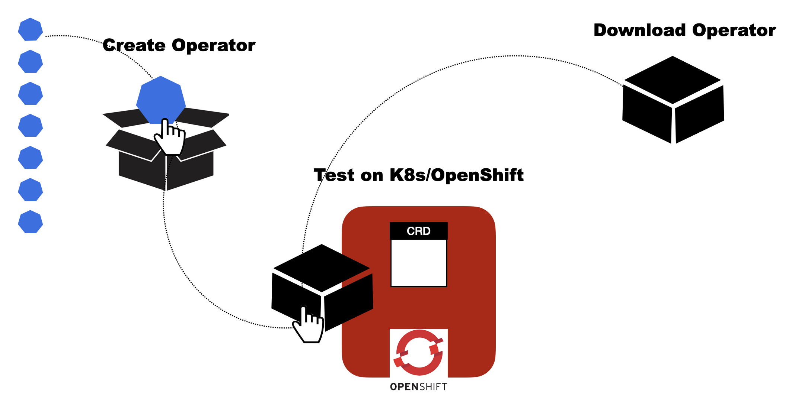

Kubernetes and OpenShift Operator StartKit is a easy to use tool to help you create Operators.

To create an Operator for his application, the user can bring in his Helm Chart, Kubernetes setup where the application is running or simply the Docker images. The tutorial will guide the user to create an Operator using any of these.

## Features of Kubernetes and OpenShift Operator StartKit

- Easy to use UI and APIs.
- Supports creating Helm or Ansible Operators.
- Supports using your own Kubernetes or OpenShift env or local Kubernetes on the Lab VM
- Test the Operator by deploying on the Lab VM or your own Openshift.
- Operator code can be downloaded for further enhancements.

## Flow of the tutorial

## Objective of tutorial

In this tutorial,we are going to cover following topics:

Option A: Create a sample nginx application whose Operator will be created

Option B: 

1. Create Operator from the local K8s from this Lab
2. Install the Operator on the local K8s from this Lab
3. Uninstall the Operator from the local K8s from this Lab
4. Download the Operator code