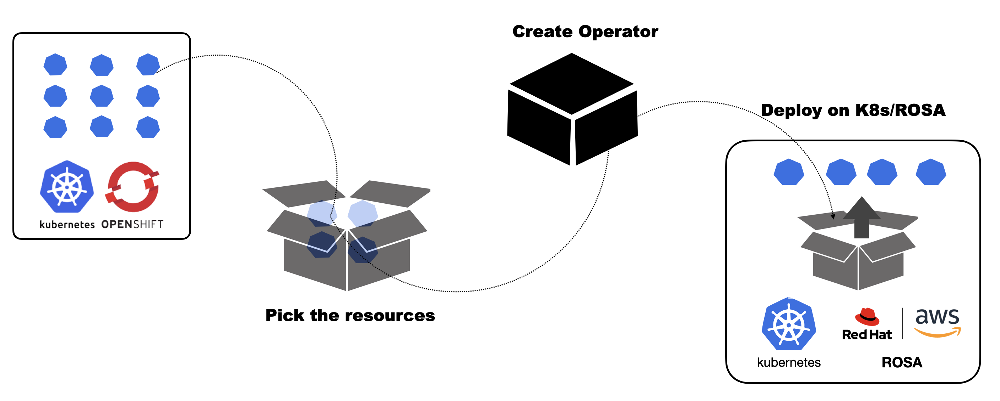

Kubernetes and OpenShift Operator StartKit is a easy to use tool to help you create Operators.

To create an Operator for his application, the user can bring in his Helm Chart, Kubernetes setup where the application is running or simply the Docker images. The tutorial will guide the user to create an Operator using any of these.

## Features of Kubernetes and OpenShift Operator StartKit

- Easy to use UI and APIs.
- Supports creating Helm or Ansible Operators.
- Supports using your own Kubernetes or OpenShift env or local Kubernetes on the Lab VM
- Test the Operator by deploying on the Lab's Kubernetes or on Red Hat OpenShift Service on AWS (ROSA).
- Operator code can be downloaded for further enhancements.

## Objective of tutorial

The Tutorial aims at creating an Operator for any of the below options:

Option A: Setup a sample Nginx application

Option B: Setup Postgresql Crunchy DB and an application using the DB

Option C: Setup your own application stack

Once any 1 of the above setups are done, go ahead with the topics below: 

1. Create Operator from the local K8s
2. Install the Operator on the local K8s
3. Uninstall the Operator from the local K8s
4. Download the Operator code